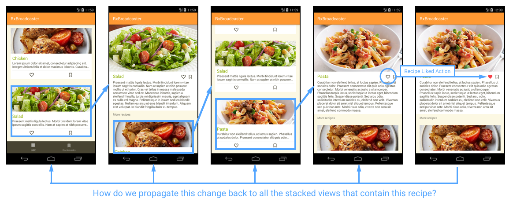
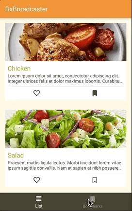
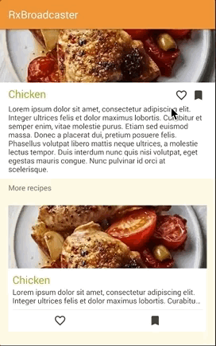

# WIP
## ViewsWaiter - Background View Updater


> Whiskey's gone but I ain't leaving. There's got to be a bottle in the back.

### Hey View! Keep up!
A common question in Android app development is -how do I update stacked views?- You start in an item list, maybe go further in the stack and then you update the state of one of those items... but when you press back the changes are not reflected in your stacked views ☹️



Our goal with this *library* (!?) is to provide a simple solution for this problem, by creating a mininal wrapper around well known RxJava components in order to **communicate with stacked activities/fragments** (stacked means: not in the foreground).


---
#### Disclaimer
Before diving into the docs, you should know that there are many other ways to tackle the update of background views: you could reload the views based on a common source of truth (fetching from data layer), you could also use the infamous `OnActivityResult` when you only need to notify the previous activity. Other people have resorted to using an Event Bus (everyone tells you why should not use it, but everyone is using it).  

# What you'll find in this library
## Pipelines
Pipelines represent a specific action or behavior associated with a data structure:

```kotlin
val likeRecipePipeline = ViewsWaiter<Recipe>()
```

You should hold your pipelines globally, as they must be shared amongst all the components that you want to communicate with.

## Channels
From a pipeline you can create channels to subscribe or emit actions for specific items (i.e. the user liked recipe #123).
A channel is identified by a string, and can be accessed like this:

```kotlin
val likeRecipePipeline = ViewsWaiter<Recipe>()
val channel = likeRecipePipeline.channel("123")
```
Then use the channel in the same way you would use a pipeline (emit/subscribe).

## Streams
The stream you get from a pipeline is a regular RxJava Observable, so you can chain it and use operators on it.

### Only receive events on background views
In this library we provide the `.bindOnBackground()` RxJava operator, that accepts a **lifecycle** as a parameter and will handle that events are only received when the actrivity is on background.
This will prevent you to subscribe to events emitted from the same activity.

```kotlin
likeRecipePipeline.stream()
	.bindOnBackground(lifecycle)
	.subscribe { likedItem ->
    	// here we will only get events emmited from other activities 
    	// when this activity is in the background
	}
```

Unless you have a very good reason to do this, you should **always** use this operator when subscribing to a stream, and handle the update of the current view with regular methods (i.e. calling the view from the presenter).

### Updating lists
For lists views, you probably want to subscribe to a stream without specifying a channel to listen to all emitted events.

```kotlin
likeRecipePipeline.stream().subscribe { likedItem ->
    // update list if necessary
}
```

### Detail Views
For detail views you should get stream for a specific channel, that way you'll only subscribe to events targeted for that specific item.

```kotlin
likeRecipePipeline.channel(item.id).stream().subscribe { likedItem ->
    // update view
}
```

## Emitting
You can create types to model actions but it's not necessary, as the pipelines already give a good representation.

When emitting events it's best to always emit in a channel, that way you can decide how specifically you want to subscribe to them.

```kotlin
likeRecipePipeline.channel(item.id).emit(item)
```

# HOW and WHEN to use this library?
In this repository we provide a [sample application](/app) where you can see a (simplified) usage of ViewsWaiter, you can take a deeper look at the code, but let's go through the basic use cases.

## Where NOT to use ViewsWaiter
### 1. To update views/fragments that share the same host
Sometimes you have views or fragments inside the same host activty, maybe using a ViewPager, maybe with a simple FrameLayout where you inject the fragments.  
When you change something in one of the fragments you want this change to propagate to the rest of the fragments (if there is a shared representation of the data).  
This update should be handled by the host activity, NOT with ViewsWaiter. You can use basic PublishSubject/Observables, or declare interfaces in the fragments that the host will consume to notifiy the rest of the fragments when somethin is updated, is up to you. 

Here are two examples in the sample app where we do NOT use ViewsWaiter to update the views.  
 

### 2. Whenever you can use OnActivityResult
If you feel like you can use `OnActivityResult` for the job, use it.  
A lot of times you don't need to update all the stack of activities, you just need to get a single result from the current activity, in those cases you should avoid using ViewsWaiter and favor `OnActivityResult`.

### 3. When a stacked activity has been killed by the system
Whenever a stacked activity is killed by the system, the subscription to the ViewsWaiter pipeline will be destroyed (be aware that the unsubscription should be handled by the client), so the next time the `onCreate` method of this activity/fragment is called you should recreate your view from an updated data source (cache, API, etc).   

## Where to use ViewsWaiter
### 1. When you want to update stacked views
If your flow allows the user to stack views that should be updated when an action is performed in the currently visible view, you can use ViewsWaiter to notify those stacked views, make sure to use the `bindOnBackground` RxJava operator provided by this library to make sure that the events are only received by stacked views (and not by the activity that's in the foreground).

